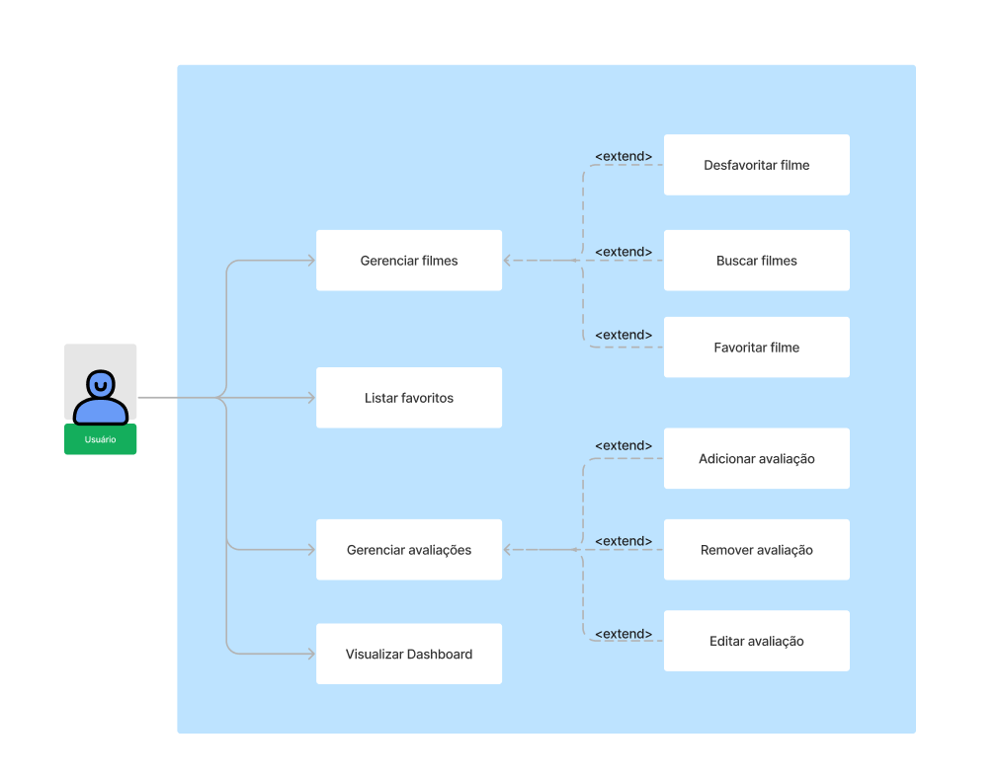

# Desafio-Tecnico-Coletor-de-Dados-de-Filmes
Com certeza\! Aqui está um sumário gerado a partir do seu arquivo `README.md`. Você pode utilizá-lo para navegar rapidamente pelas seções principais do documento.

## Sumário

  - [Contextualização](https://www.google.com/search?q=%23contextualiza%C3%A7%C3%A3o)
  - [Funcionalidades](https://www.google.com/search?q=%23funcionalidades)
  - [Decisões de Projeto](https://www.google.com/search?q=%23decis%C3%B5es-de-projeto)
  - [Perguntas do Desafio](https://www.google.com/search?q=%23perguntas-do-desafio)
  - [Diagrama de Casos de Uso](https://www.google.com/search?q=%23diagrama-de-casos-de-uso)
  - [Diagrama de Classes (Backend)](https://www.google.com/search?q=%23diagrama-de-classes-backend)
  - [Funcionamento do Sistema](https://www.google.com/search?q=%23funcionamento-do-sistema)
  - [Rodando o Projeto Localmente](https://www.google.com/search?q=%23rodando-o-projeto-localmente)
  - [Estrutura do Projeto](https://www.google.com/search?q=%23estrutura-do-projeto)


## Contextualização
O Coletor de Dados de Filmes é uma aplicação fullstack onde o usuário pode buscar filmes, 
favoritar seus filmes preferidos, registrar reviews pessoais e 
coletar/analisar dados sobre suas buscas e preferências cinematográficas. 
O sistema tem como foco o controle pessoal de filmes assistidos com elementos de 
organização e análise de dados, funcionando como uma ferramenta pessoal que 
coleta insights sobre seus hábitos de busca.


##  Funcionalidades

- Coleta de Dados (OMDb API): API pública que retorna dados sobre filmes.
- Armazenamento Persistente: Os dados coletados são salvos em um banco de dados SQLite.
- API RESTful:  API desenvolvida com FastAPI para armazenar informações do usuário como filmes favoritos, avaliações e histórico


## Decisões de Projeto
O projeto utiliza da Arquitetura de Camadas e Injeção de Dependência para garantir um código limpo, testável e de fácil manutenção.

###  Backend
Camadas com responsabilidades bem definidas:

- Controller: Gerencia as requisições HTTP e serve como ponto de entrada da API.
- Service: Executa a lógica e as regras de negócio da aplicação.
- Repository: Abstrai o acesso aos dados, isolando as consultas SQL do resto do sistema.
- Model: Define as entidades e a estrutura de dados do domínio.
- DTO: Modela os dados para transferência entre camadas e para o cliente, garantindo uma interface de comunicação clara e segura.
- Config: Centraliza as configurações e variáveis de ambiente.

###  Frontend
A estrutura de pastas foi organizada para priorizar o reuso de código:

- pages: Telas principais da aplicação.
- componentes: Componentes de UI reutilizáveis (botões, cards, etc.).
- api: Centraliza as chamadas para o backend.
- hooks: Lógica de estado reutilizável.
- util: Funções auxiliares.


###  Banco de Dados
O projeto utiliza um banco de dados relacional para persistir as informações. A modelagem foi centrada em três tabelas principais:

-   **`Avaliacoes`**: Armazena as notas e os comentários que o usuário atribui a um determinado filme.
-   **`Favoritos`**: Mantém os filmes preferidos de cada usuário, permitindo acesso rápido.
-   **`Historico`**: Funciona como um catálogo local, guardando informações dos filmes consultados (título, ano, gênero, nota do IMDb).


##  Perguntas do Desafio

### Qual foi o maior desafio técnico? 
- Durante o desenvolvimento da solução acredito que o meu maior desafio técnico foi lidar com a criação da interface web por ser um campo que possuo menos domínio


### Que insights interessantes o dashboard poderia oferecer?
- Além de destacar o gênero preferido do usuário, quantidade de buscas, ano dos filmes mais assistido. O dashboard poderia revelar padrões de consumo (atores e diretores mais assistidos), tendências de popularidade de gêneros


### Como você organizou e estruturou os dados coletados? 
Os dados coletados foram estruturados em três tabelas principais:
- Favoritos
- Historico
- Avaliacoes


### O que faria diferente com mais tempo? 
#### Com mais tempo, focaria em evoluções:
- Segurança: Implementaria autenticação com tokens JWT.
- Robustez: Adicionaria testes automatizados, serviço de envio de email e um sistema de exceções personalizadas.
- Deploy: Dockerizaria a aplicação e realizaria o deploy em uma plataforma de nuvem como Render e Vercel.


### Quais ferramentas/aceleradores de desenvolvimento utilizou?
#### Utilizei ferramentas de IA como aceleradores de desenvolvimento:
- Lovable AI: Para prototipar design e componentes de frontend de maneira ágil.
- Gemini: Como assistente para solucionar dúvidas, refatorar código e consultar boas práticas.


## Diagrama de Casos de Uso


## Diagrama de Classes (Backend)


## Funcionamento do Sistema


##  Rodando o Projeto Localmente

### Pré-requisitos

Antes de começar, certifique-se de ter instalado em sua máquina:

- **Python 3.8+** (recomendado: Python 3.11+)
- **Node.js 16+** (recomendado: Node.js 18+)
- **npm** ou **yarn** (gerenciador de pacotes do Node.js)

### 1. Clone o repositório localmente:
````bash
git clone https://github.com/RafaelFFranco/Desafio-Tecnico-Coletor-de-Dados-de-Filmes.git
````


### Backend (API)
#### 1. Navegue até o diretório do backend:
```bash
cd src/backend/ColetorDadosBack
```

#### 2. Crie um ambiente virtual (recomendado):
```bash
# Windows
python -m venv venv
venv\Scripts\activate

# Linux/Mac
python3 -m venv venv
source venv/bin/activate
```

#### 3. Instale as dependências:
```bash
pip install -r requirements.txt
```

#### 4. Execute o servidor:
```bash
uvicorn main:app --reload
```

### Frontend (Interface Web)
#### 1. Navegue até o diretório do frontend:
```bash
cd src/frontend/ColetorDadosFront
```

#### 2. Instale as dependências:
```bash
npm install
```

#### 3. Execute o servidor de desenvolvimento:
```bash
npm run dev
```

O frontend estará disponível em:
- **Aplicação**: http://localhost:5173

### Executando o Projeto Completo

Para executar o projeto completo:

1. **Abra dois terminais separados**

2. **No primeiro terminal** (Backend):
```bash
cd src/backend/ColetorDadosBack
# Ative o ambiente virtual se criou um
# venv\Scripts\activate  # Windows
# source venv/bin/activate  # Linux/Mac
uvicorn main:app --reload --host 0.0.0.0 --port 8000
```

3. **No segundo terminal** (Frontend):
```bash
cd src/frontend/ColetorDadosFront
npm install
npm run dev
```

4. **Acesse a aplicação**: http://localhost:5173

### Estrutura do Projeto

```
src/
├── backend/ColetorDadosBack/          # API FastAPI
│   ├── controller/                    # Controladores das rotas
│   ├── model/                         # Modelos do banco de dados
│   ├── repository/                    # Camada de acesso aos dados
│   ├── service/                       # Lógica de negócio
│   ├── dto/                          # Data Transfer Objects
│   ├── config/                       # Configurações (banco de dados)
│   ├── main.py                       # Arquivo principal da API
│   └── requirements.txt              # Dependências Python
└── frontend/ColetorDadosFront/        # Interface React
    ├── src/
    │   ├── componentes/              # Componentes React
    │   ├── pages/                    # Páginas da aplicação
    │   ├── api/                      # Serviços de API
    │   ├── types/                    # Definições TypeScript
    │   └── hooks/                    # Custom hooks
    ├── package.json                  # Dependências Node.js
    └── vite.config.ts               # Configuração do Vite
```

